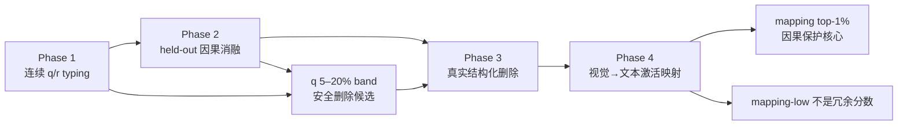

# Qwen3.5-VL-0.8B 模态相关 FFN 神经元研究：Phase 1–4 阶段汇报

## 0. 汇报摘要

### 0.1 一句话结论

本研究建立了从连续模态选择性建模、因果消融、真实结构化删除，到视觉表示预测文本侧 FFN 激活的完整实验链条。核心发现是：

> VLM 的 FFN 神经元不能被可靠地划分为少数离散且可直接剪除的类型；`q_multimodal` 与视觉→文本 activation mapping 提供了互补的功能信息。前者识别出一个可以安全结构化删除的中等共激活纯度 rank band，后者识别出一个需要保护的紧凑视觉因果核心。

### 0.2 当前已经取得的主要成果

1. 修正并验证了一套适用于 Qwen3.5-VL 混合 FA/GDN 架构的连续神经元 typing 方法，将代表性响应纯度 `q` 与全数据响应频率 `r` 分开建模。
2. 通过严格 held-out Caption NLL 与三个 POPE split 证明：
   - `q_multimodal` 的因果效应是非单调的；
   - top-5% 含重要 specialist；
   - 5–20% rank band 是当前通过全部任务安全检查的 15% functional mask；
   - 低激活频率不是安全冗余指标；
   - magnitude 在 Caption NLL 上看似安全，但会严重破坏物体识别并使模型偏向回答 `no`。
3. 将 hook-based 5–20% q-band 转化为真实结构化 checkpoint：
   - 删除 39,591,936 个参数；
   - 全模型参数下降 4.642%；
   - checkpoint 下降约 117.42 MiB；
   - 峰值显存下降约 74–75 MiB；
   - Caption 与三个 POPE split 的任务安全 gate 全部通过。
4. 证明视觉表示可以预测 shuffled-image 引起的文本侧 FFN 激活差：
   - 24 层平均 test \(R^2=0.1080\)；
   - Q-only 平均 \(R^2=-0.0140\)；
   - 视觉增量 \(R^2=0.1220\)；
   - permutation empirical \(p=0.0476\)；
   - 24/24 层 \(R^2>0\)。
5. Phase 4 因果剂量实验进一步表明：
   - mapping top-1% 是一个紧凑且具有统计支持的视觉因果核心；
   - mapping ranking 在更大比例上不满足单调因果排序；
   - mapping predictability 应作为保护信号，而不能取反后直接作为删除分数。

### 0.3 当前不能声称的内容

- 不能把 `q_multimodal` 称为“视觉→语言激活映射分数”；它是模态共激活纯度。
- 不能声称 FA 层显著富集 multimodal 神经元；目前仅有描述性差异，blocked permutation 不显著。
- 不能声称低激活频率、低 mapping signal 或 unknown 神经元是安全冗余。
- 不能声称 Phase 3 获得了整体推理加速；真实参数、存储和显存下降成立，但当前 RTX 4090 + torch SDPA 后端的 prefill 没有加速。
- 不能根据 Phase 4 的 `combined_protection` 或 mapping-low 直接构造新结构化剪枝模型。

---

## 1. 研究问题与整体路线

### 1.1 模型与研究对象

| 项目 | 设置 |
|---|---|
| 模型 | Qwen3.5-VL-0.8B |
| Decoder 层数 | 24 |
| FFN intermediate size | 3,584 |
| FFN 神经元总数 | \(24\times3584=86,016\) |
| MLP | SwiGLU |
| Full Attention 层 | 3、7、11、15、19、23 |
| GatedDeltaNet 层 | 其余 18 层 |
| 神经元定义 | `silu(gate_proj(x)) * up_proj(x)` 的单个 intermediate channel |
| Hook 位置 | 每层 `down_proj` 的 forward-pre-hook |

### 1.2 原始假设

- H1：FFN 神经元存在视觉、文本、多模态等功能选择性，并可能具有 FA/GDN 层结构。
- H2：这些选择性具有因果意义，不同神经元集合的消融会产生不同任务损伤。
- H3：模态信息能够提供 magnitude 和 activation frequency 之外的安全剪枝信息。
- H4：视觉表示能够预测由图像引起的语言侧 FFN 激活，并进一步定位因果子空间。

### 1.3 实际形成的证据链

这里最终形成的是两种互补信号：

- `q_multimodal`：神经元在代表性高响应样本中的视觉/文本共激活纯度；
- `mapping_signal`：视觉表示对 shuffled-image 文本侧激活差的可预测性及其效应量。

---

## 2. 数据审计与方法修正

正式结论建立在一次关键的数据和实现审计之后。早期名为 `phase1_2k_v2` 的目录实际只处理了 400 行，原因是旧的 tokenized cache 覆盖了请求的样本数；其中还存在大量重复图像，并且 typing 与评估复用了数据。因此早期数字仅作为工程诊断，不作为论文证据。

修正后的流水线加入了：

- 只使用已验证的 COCO val 数据源；
- calibration、typing、evaluation 写入独立 sample manifest；
- 正式评估前检查 image ID 零重叠；
- cache 长度不足时直接失败；
- 重复图像超过阈值时直接失败；
- typing 与评估严格 held-out；
- Phase 4 按 image ID 划分 train/validation/test，同图像的所有问题只能进入同一 split。

此外修复了以下方法问题：

1. 深浅层激活尺度相差约 3–5 倍，不能直接移植固定阈值；
2. float16 下 `1e-8` clamp 下溢为 0，导致除零和 NaN；
3. 视觉 token 远多于文本 token，需要分别校准阈值；
4. minimum-count 判定存在 `>` 与 `>=` 的 off-by-one；
5. streaming top-K 样本被替换后，旧 type count 没有回退；
6. visual/text top-K 合并时未按 sample ID 去重；
7. 旧 `p_*` 使用不同分母，不可组成统一概率向量；
8. dead neuron mask 未被序列化；
9. q/r 的语义曾被混用。

这些修正本身也是研究贡献的一部分：它们说明 VLM 神经元 typing 对阈值、token 数量、top-K 维护和数据隔离非常敏感。

---

## 3. Phase 1：连续模态选择性建模

## 3.1 研究目标

Phase 1 回答两个问题：

1. FFN channel 是否呈现稳定的视觉/文本响应差异？
2. 这种差异应该被表示为离散类型，还是连续选择性？

## 3.2 q/r 定义

对每个样本和神经元，分别统计超过校准阈值的视觉 token 数和文本 token 数，并将样本级响应划分为：

\[
\text{visual},\quad \text{text},\quad \text{multimodal},\quad \text{unknown}.
\]

### 代表性响应纯度 q

令 \(S_n^v\) 和 \(S_n^t\) 分别是神经元 \(n\) 的视觉与文本 top-K 样本，使用去重并集：

\[
S_n=S_n^v\cup S_n^t.
\]

则：

\[
q_c(n)=
\frac{\#\{s\in S_n:\operatorname{type}(n,s)=c\}}
{|S_n|}.
\]

`q` 描述的是高响应代表样本中的类型纯度。

### 全数据响应频率 r

\[
r_c(n)=
\frac{\#\{s\in D:\operatorname{type}(n,s)=c\}}
{|D|}.
\]

`r` 描述的是整个 typing 数据集中的响应频率。

二者不能合并解释：一个神经元可以平时很少响应，但一旦强响应就高度 multimodal。

## 3.3 正式设置

| 项目 | 数值 |
|---|---:|
| Calibration 样本 | 500 |
| Typing 样本 | 2,000 |
| Visual threshold | per-neuron q97 |
| Text threshold | per-neuron q95 |
| visual/text minimum count | 分别按配置校准 |
| Top-K | 50 |
| 总神经元 | 86,016 |
| Alive | 86,013 |
| Dead | 3 |

## 3.4 当前正式产物中的分布

以下数字以当前正式
`phase1_clean_2k/scores/neuron_type_scores.parquet` 为准。

### Forced dominant type

| Dominant type | 数量 | 占全部神经元 |
|---|---:|---:|
| Multimodal | 54,767 | 63.67% |
| Visual | 31,113 | 36.17% |
| Unknown | 67 | 0.078% |
| Text | 66 | 0.077% |
| Dead | 3 | 0.003% |

这里的 dominant type 只是 `argmax(q)`，不能理解为高置信离散类别。

### q/r 均值

| 指标 | Mean | Median | 解释 |
|---|---:|---:|---|
| `q_visual` | 0.4344 | 0.4286 | 代表性高响应样本中的视觉纯度 |
| `q_text` | 0.0625 | 0.0532 | 代表性高响应样本中的文本纯度 |
| `q_multimodal` | 0.4915 | 0.4949 | 代表性高响应样本中的共激活纯度 |
| `q_unknown` | 0.0116 | 0 | 代表性样本中双侧均不响应的比例 |
| `r_visual` | 0.6343 | 0.6435 | 全数据视觉响应频率 |
| `r_text` | 0.0239 | 0.0225 | 全数据文本响应频率 |
| `r_multimodal` | 0.1168 | 0.1220 | 全数据共激活频率 |
| `r_unknown` | 0.2250 | 0.2135 | 全数据低响应频率 |

### 连续性证据

- 仅 8,478 个 alive 神经元满足 `max(q) >= 0.7`，占 9.86%；
- 77,535 个神经元属于 mixed/low-confidence，占约 90.14%；
- 1,869 个神经元出现 dominant exact tie；
- 16,963 个神经元 top-two q margin 小于 0.05；
- 33,262 个神经元 top-two q margin 小于 0.10。

这直接支持“连续模态选择性”表述，而不支持把全部 86,016 个神经元硬分成四种确定类型。

## 3.5 FA 与 GDN

高置信阈值 `q >= 0.7` 下，FA 相对 GDN 有小幅描述性富集：

| 类型 | FA ratio | GDN ratio | 差值 |
|---|---:|---:|---:|
| Visual | 4.683% | 3.331% | +1.353 pp |
| Multimodal | 6.585% | 5.999% | +0.587 pp |
| Unknown | 0.070% | 0.033% | +0.037 pp |
| Text | 0 | 0 | 0 |

但以 6 个 FA/GDN block 为统计单位的 exact blocked permutation 结果为：

| 类型 | Observed difference | p-value | 95% bootstrap CI |
|---|---:|---:|---:|
| Visual | +1.353 pp | 0.5938 | [-0.801, 4.803] pp |
| Multimodal | +0.587 pp | 0.8125 | [-3.934, 5.420] pp |
| Unknown | +0.037 pp | 0.5000 | [-0.031, 0.129] pp |
| Text | 0 | 1.0000 | [0, 0] |

因此 H1 的“存在连续功能选择性”得到支持，但“FA 层显著富集某类神经元”未得到统计支持。

## 3.6 500 与 2,000 样本稳定性

使用同一 calibration，并确保 500 样本是 2,000 样本的严格前缀：

| `q_multimodal` 稳定性指标 | 结果 |
|---|---:|
| Global Spearman | 0.8182 |
| Per-layer Spearman mean / median | 0.7695 / 0.7658 |
| Per-layer min / max | 0.6596 / 0.8776 |
| 5–20% band 每个 run 的大小 | 12,888 |
| Band intersection | 5,385 |
| Global Jaccard | 0.2641 |

解释：

- 500 样本足以恢复总体排名趋势；
- 但不足以稳定恢复两个移动边界之间的精确 5–20% rank band；
- 因此 Phase 3 冻结的是完整 2,000 样本产生的 mask，而不是 500 样本 pilot mask。

## 3.7 Phase 1 结论

Phase 1 最重要的成果不是得到四个离散类型，而是建立了一个更加可靠的连续表征：

> `q` 分离了代表性强响应的模态纯度，`r` 分离了全数据响应频率。绝大多数神经元是 mixed/low-confidence，离散标签会夸大确定性。

---

## 4. Phase 2：因果消融与安全 mask 选择

## 4.1 研究目标

Phase 2 检验 q/r 是否不仅是相关性描述，而且能够定位具有不同因果效应的 FFN 子空间。

消融使用 `down_proj` forward-pre-hook，将指定 intermediate channels 置零，不修改模型参数。所有正式评估与 calibration、typing 图像隔离。

主要任务：

- COCO Caption teacher-forced label NLL；
- POPE random、popular、adversarial；
- POPE 使用 Accuracy、F1、yes ratio；
- 使用 image-cluster bootstrap 置信区间。

## 4.2 首个重要发现：q 与因果重要性非单调

早期 cumulative sweep 已显示：

- `q_multimodal` top-5% 消融会恶化 Caption NLL；
- 扩大到 top-20% 后，整体效应反而缓解甚至改善；
- 高 `r_unknown` 在 20%–50% 时明显损伤模型；
- 因此不能把低响应或 unknown 简单解释成噪声。

由此提出 rank-band 假设：

> 保护极端 top-5% multimodal specialist，仅删除其后的 5–20% 中等纯度子空间。

该 mask 每层删除 537 个 channel，共 12,888 个，占 FFN channels 的 14.983%。

## 4.3 Held-out Caption NLL

在 500 个 held-out caption 样本上：

| 条件 | NLL | ΔNLL |
|---|---:|---:|
| Original | 4.106730 | 0 |
| q 5–20% band | 3.974039 | -0.132691 |
| Matched random seed 1 | 4.238996 | +0.132266 |
| Lowest magnitude | 3.974513 | -0.132217 |
| Lowest activation frequency | 4.298968 | +0.192238 |

仅看 Caption NLL，q-band 与 magnitude 几乎打平；因此 Caption NLL 单独不足以决定 mask 安全性。

## 4.4 三个 POPE split 的安全证据

### POPE random

| 条件 | Accuracy | ΔAccuracy | F1 | Yes ratio |
|---|---:|---:|---:|---:|
| Original | 0.9097 | 0 | 0.9039 | 0.4390 |
| q 5–20% band | 0.9028 | -0.0069 | 0.8956 | 0.4313 |
| Matched random | 0.8878 | -0.0219 | 0.8867 | 0.4901 |
| Lowest magnitude | 0.7325 | -0.1773 | 0.6351 | 0.2332 |
| Lowest activation frequency | 0.7851 | -0.1246 | 0.7423 | 0.3341 |

### POPE popular

| 条件 | Accuracy | ΔAccuracy | F1 | Yes ratio |
|---|---:|---:|---:|---:|
| Original | 0.8798 | 0 | 0.8760 | 0.4697 |
| q 5–20% band | 0.8757 | -0.0040 | 0.8704 | 0.4591 |
| Matched random | 0.8421 | -0.0376 | 0.8476 | 0.5358 |
| Lowest magnitude | 0.7310 | -0.1488 | 0.6356 | 0.2383 |
| Lowest activation frequency | 0.7643 | -0.1155 | 0.7240 | 0.3542 |

### POPE adversarial

| 条件 | Accuracy | ΔAccuracy | F1 | Yes ratio |
|---|---:|---:|---:|---:|
| Original | 0.8531 | 0 | 0.8524 | 0.4956 |
| q 5–20% band | 0.8469 | -0.0062 | 0.8450 | 0.4879 |
| Matched random | 0.8194 | -0.0336 | 0.8293 | 0.5577 |
| Lowest magnitude | 0.7292 | -0.1239 | 0.6330 | 0.2379 |
| Lowest activation frequency | 0.7632 | -0.0899 | 0.7233 | 0.3560 |

每个 split 使用 456 张 held-out 图像、2,736 个平衡 yes/no 问题。

## 4.5 Phase 2 的核心因果结论

### 结论一：q 5–20% band 是当前唯一通过全部安全检查的 15% mask

- Caption NLL 不恶化；
- 三个 POPE split 的 Accuracy 下降均小于 1 个百分点；
- yes ratio 仍接近原模型；
- 同数量 matched random 在三个 split 上损伤更大。

### 结论二：Magnitude 的 Caption 安全是假象

Magnitude 与 q-band 的 Caption NLL 几乎相同，但 POPE Accuracy 下降 12.4–17.7 个百分点，yes ratio 稳定下降到约 0.24。

这表明它不是“总体能力略降”，而是产生了严重的回答 `no` 偏置。

### 结论三：低激活频率不是安全冗余指标

最低 activation frequency mask 在三个 POPE split 上分别下降 12.46、11.55、8.99 个百分点，说明低频集合中包含重要视觉 specialist。

### 结论四：q/r 提供了传统分数没有的功能信息

在相同 per-layer 删除数量下：

- magnitude 不能预测 POPE 安全；
- activation frequency 不能预测 POPE 安全；
- q-band 同时保持 Caption 与物体识别。

因此 H2 得到支持，H3 在“安全 mask 选择”层面得到支持。

---

## 5. Phase 3：从 functional ablation 到真实结构化压缩

## 5.1 研究目标

Phase 2 只能证明“把这些 channels 置零是安全的”。Phase 3 将相同 mask 转换为物理结构删除：

- `gate_proj` 删除对应输出行；
- `up_proj` 删除对应输出行；
- `down_proj` 删除对应输入列；
- 24 层使用一致的新 intermediate width；
- 不进行 recovery training。

测试了两个结构宽度：

1. 精确 q-band：每层 3,584 → 3,047，删除 537；
2. 硬件对齐版本：每层保留 3,072，删除 rank window 180:512，共 512。

## 5.2 结构正确性

两版 checkpoint 均通过：

- mask、cluster index 与 provenance hash；
- gate/up/down kept-weight projection hash；
- layer width 检查；
- 参数数量检查；
- in-memory structural 与 reload 后输出一致性；
- hook 与 structural 的 Caption/POPE equivalence gate。

对于 3,072 aligned 版本：

- hook Caption NLL：3.837533；
- structural Caption NLL：3.837260；
- 差值：-0.000274；
- POPE structural/hook prediction agreement：
  - random：99.744%；
  - popular：99.708%；
  - adversarial：99.635%；
- 最大 structural/hook Accuracy drift：0.146 个百分点；
- 最大 yes-ratio drift：0.183 个百分点。

BF16 宽、窄 GEMM 采用不同的累加路径，少数处于 decision boundary 的样本会翻转，因此最终 correctness gate 使用：

- kept-weight hash；
- reload output；
- task metric drift；
- prediction agreement；

而不是要求所有 BF16 预测逐样本完全相同。

## 5.3 任务安全

精确 3,047 checkpoint：

| 指标 | Original | Hook q-band | Structural |
|---|---:|---:|---:|
| Caption NLL | 4.106730 | 3.974039 | 3.979106 |
| POPE random Acc | 0.9097 | 0.9028 | 0.9031 |
| POPE popular Acc | 0.8798 | 0.8757 | 0.8750 |
| POPE adversarial Acc | 0.8531 | 0.8469 | 0.8472 |

三个 POPE split 的 Accuracy 与 yes-ratio safety gate 均通过。

aligned 3,072 checkpoint 同样通过全部 hook safety 与 structural quality gate：

- random Accuracy 下降 0.475 个百分点；
- popular 下降 0.292 个百分点；
- adversarial 下降 0.292 个百分点；
- yes-ratio shift 均小于 1.2 个百分点。

## 5.4 真实压缩收益

| Width | 删除参数 | 全模型参数下降 | 参数存储下降 | Checkpoint 下降 | 峰值显存下降 |
|---:|---:|---:|---:|---:|---:|
| 3,047 | 39,591,936 | 4.642% | 75.52 MiB | 117.42 MiB | 约 74–75 MiB |
| 3,072 | 37,748,736 | 4.425% | 72.00 MiB | 113.89 MiB | 约 70–71 MiB |

checkpoint 下降大于理论参数存储下降，部分原因是保存时移除了 tied-weight 的重复序列化；这部分不能归因于剪枝本身。

## 5.5 延迟结果

环境：

- NVIDIA RTX 4090；
- BF16；
- PyTorch 2.5.1 + CUDA 12.4；
- torch SDPA；
- 10 次 warmup、50 次测量；
- 2,000 次 bootstrap；
- 固定生成 64 tokens。

aligned 3,072 的主要结果：

| 场景 | 延迟变化 |
|---|---:|
| Multimodal prefill, batch 1 | 慢 0.333% |
| Multimodal prefill, batch 4 | 慢 0.401% |
| Text-only prefill, batch 1 | 慢 0.441% |
| Text-only prefill, batch 4 | 慢 0.645% |
| TTFT | 快 0.369% |
| 64-token total latency | 快 0.128% |
| Decode throughput | +0.106%，CI 跨 1 |

aligned width 改善了 generation，但两个主要 multimodal prefill 场景仍显著变慢，所以没有通过 overall engineering speed gate。

## 5.6 Phase 3 结论

Phase 3 成功证明：

> q/r typing 可以识别一个能够被物理删除、同时保持 Caption 和物体识别安全的 FFN 子空间，并产生真实参数、checkpoint 和峰值显存下降。

但当前不能声称整体速度收益。瓶颈更可能来自 kernel shape、backend dispatch、attention 和视觉编码占比，而不是 mask 本身。P3.5 recovery training 没有必要，因为质量 gate 已通过。

---

## 6. Phase 4：视觉表示到文本侧 FFN 激活映射

## 6.1 为什么需要 Phase 4

`q_multimodal` 回答的是：

> 一个神经元的代表性高响应样本中，有多少比例同时满足视觉 token 和文本 token 激活条件？

它不能直接证明：

- 视觉表示预测了文本侧 FFN 激活；
- 图像变化导致了语言神经元变化；
- vision merger 表示与 FFN 激活之间存在可学习映射。

因此 Phase 4 引入正确图像与 shuffled image 的配对干预。

## 6.2 映射目标

对同一个问题构造：

\[
(I,Q),\qquad (\pi(I),Q),
\]

其中 \(\pi(I)\) 是同一数据 split 内的无固定点图像置换。

记录：

- \(V\)：decoder layer-0 输入处的视觉 token hidden states；
- \(Q\)：同一位置的非视觉 prompt token hidden states；
- \(A_l^{text}\)：第 \(l\) 层 `down_proj` 输入在非视觉 prompt token 上的 pooled FFN 激活；
- 目标：

\[
\Delta A_l=A_l^{text}(I,Q)-A_l^{text}(\pi(I),Q).
\]

比较三种输入：

- Q-only；
- V-only；
- V+Q。

主模型为 reduced-rank ridge，并用 validation 选择正则参数。

## 6.3 数据隔离

| Split | Rows | Images |
|---|---:|---:|
| Train | 1,956 | 326 |
| Validation | 420 | 70 |
| Test | 414 | 69 |
| Total | 2,790 | 465 |

train、validation、test 按 image ID 完全隔离；Phase 1 calibration/typing 图像也已过滤。神经元 ranking 由 validation 产生，test 只用于最终 Gate 与因果验证。

## 6.4 Gate A/B：映射存在且具有视觉增量

| 指标 | 结果 | 预注册阈值 |
|---|---:|---:|
| 平均 V+Q test \(R^2\) | 0.10797 | ≥ 0.01 |
| 平均 Q-only test \(R^2\) | -0.01401 | — |
| 平均增量 \(R^2\) | 0.12198 | ≥ 0.002 |
| Permutation null mean | -0.03612 | — |
| Aggregate empirical p | 0.04762 | ≤ 0.05 |
| \(R^2>0\) 的层数 | 24/24 | ≥ 4 |

Gate A 和 Gate B 均通过。

这说明预测能力主要来自视觉表示，而不是问题文本本身。

### 分层趋势

V+Q test \(R^2\)：

- Layer 0–5 平均：0.1998；
- Layer 6–11 平均：0.0945；
- Layer 12–17 平均：0.0519；
- Layer 18–23 平均：0.0857。

表现为前层最强、中后层降低、末端略回升。

### Top-k 触发预测

在每层预测 top-128 个 \(|\Delta A|\) 神经元：

- 平均 Precision/Recall@128：0.3246；
- 最低：0.2278；
- 最高：0.5162；
- 随机期望：\(128/3584=0.0357\)。

说明映射不仅解释总体方差，也能预测被图像改变最大的神经元集合。

### 与 q_multimodal 的关系

- 全层 `mapping_signal` 与 `q_multimodal` Spearman：0.1505；
- 单层相关通常接近 0，最大约 0.1397。

因此两种分数相关性很弱，说明它们捕捉的是不同功能属性：

- q：视觉/文本 token 共激活纯度；
- mapping：视觉变化能否预测文本侧 activation change。

## 6.5 Gate C：15% group causality

在 69 张 image-disjoint test 图像、每个 POPE split 414 个问题上比较：

- q 5–20% band；
- mapping-high 15%；
- combined-protection-low 15%；
- matched random。

| Split | Mapping-high ΔAcc | Matched-random mean ΔAcc | Causal enrichment | q-band ΔAcc | Combined-low ΔAcc |
|---|---:|---:|---:|---:|---:|
| Random | -0.4082 | -0.1538 | +0.2544 | -0.0097 | -0.1111 |
| Popular | -0.3937 | -0.1562 | +0.2375 | -0.0097 | -0.1812 |
| Adversarial | -0.3744 | -0.1465 | +0.2279 | -0.0266 | -0.1787 |

结果：

- mapping-high 相对 matched random 的因果富集 gate 通过；
- combined-low 安全 gate 失败；
- `phase4_structural_candidate_allowed=false`。

这一步证明 mapping-high 集合包含强因果信号，但也推翻了“低 combined score 可以安全删除”的直接假设。

## 6.6 P4.4a：mapping-high 因果剂量曲线

为了避免 15% 大规模消融造成的饱和与随机 collapse，进一步测试严格嵌套的：

\[
1\%,\ 2.5\%,\ 5\%,\ 10\%,\ 15\%.
\]

每个比例都有：

- q-high 同数量 comparator；
- 20 个 global matched-random；
- 20 个 q-stratified matched-random。

q-stratified control 在每层精确匹配 mapping mask 的 `q_multimodal` decile 构成，因此能够检验 mapping 是否提供 q 之外的因果信息。

### 三个任务的 mapping-high ΔAccuracy

| Ratio | Random | Popular | Adversarial |
|---:|---:|---:|---:|
| 1% | -0.0314 | -0.0266 | -0.0193 |
| 2.5% | -0.0266 | -0.0266 | -0.0242 |
| 5% | -0.0145 | -0.0024 | -0.0121 |
| 10% | -0.0821 | -0.1039 | -0.1184 |
| 15% | -0.4082 | -0.3937 | -0.3744 |

三个 split 都出现同样的非单调形态：

- 1%–2.5% 已有损伤；
- 扩大到 5% 后损伤反而减弱；
- 10% 出现明显相变；
- 15% 全部退化为 `yes`，yes ratio = 1。

对应的剂量 Spearman：

| Split | Spearman |
|---|---:|
| Random | 0.6000 |
| Popular | 0.6669 |
| Adversarial | 0.7000 |
| Median | 0.6669 |

低于预注册阈值 0.8，因此单调剂量 gate 失败。

### Random split 的对照检验

| Ratio | Mapping ΔAcc | Global p | q-stratified p | 是否同时富集 |
|---:|---:|---:|---:|---|
| 1% | -0.0314 | 0.0476 | 0.0476 | 是 |
| 2.5% | -0.0266 | 0.0476 | 0.0952 | 否 |
| 5% | -0.0145 | 0.2857 | 0.4286 | 否 |
| 10% | -0.0821 | 0.2381 | 0.1429 | 否 |
| 15% | -0.4082 | 0.0952 | 0.0952 | 否 |

只有 top-1% 同时超过两种控制，因此预注册要求的“至少 3/5 个比例富集”失败。

### Top-1% 的证据强度

top-1% 每层 36 个神经元，总计 864 个：

- Random split ΔAccuracy = -3.14 个百分点；
- 95% image bootstrap CI = [-5.31, -1.21] 个百分点；
- 20 个 global random 均值 = -0.19 个百分点；
- 20 个 q-stratified random 均值 = -0.36 个百分点；
- 对两种控制的 empirical \(p=1/21=0.0476\)；
- 三个 POPE split 的效应方向一致。

因此 top-1% 是 Phase 4 当前最强、最干净的因果定位结果。

### 为什么 15% 的巨大损伤不是更强的定位证据

在 15% 时：

- mapping mask ΔAccuracy 约 -40.8 个百分点；
- global random 也有 10% 的 collapse frequency；
- q-stratified random 有 15% 的 collapse frequency；
- 指标在 all-yes 输出处饱和并产生 ties。

因此 15% 说明大规模 FFN 消融会触发非线性崩溃，但不能证明这种崩溃是 mapping 集合独有的。

## 6.7 Phase 4 结论

Phase 4 支持：

> 视觉表示能够预测图像诱导的文本侧 FFN 激活差，并且 mapping signal 的极高尾部定位了一个紧凑的跨模态因果核心。

但同时表明：

> Mapping predictability 不是跨全部 rank 的单调因果重要性，也不是可取反使用的冗余分数。它更适合作为保护约束。

---

## 7. Phase 1–4 的总体证据矩阵

| 研究命题 | 主要证据 | 结论 |
|---|---|---|
| FFN 神经元有模态选择性 | q/r 分布、q margin、high-confidence 比例 | 支持连续选择性，不支持普遍离散类型 |
| FA 比 GDN 更 multimodal | 描述差 +0.587 pp；blocked p=0.8125 | 未获统计支持 |
| q/r 具有因果信息 | q rank 非单调消融、q-band 与 baselines 差异 | 支持 |
| 低频神经元是安全冗余 | Activation-frequency POPE 大幅下降 | 否定 |
| Magnitude 足以选择安全 mask | Caption 打平但 POPE 下降 12–18 pp | 否定 |
| q 5–20% band 可安全删除 | Caption + 三个 POPE held-out gate | 支持 |
| hook 安全可转化为真实删除 | Structural equivalence + quality gate | 支持 |
| 结构删除带来真实压缩 | 参数、checkpoint、显存下降 | 支持 |
| 结构删除带来整体加速 | Prefill 仍轻微变慢 | 未支持 |
| 视觉表示能预测文本 FFN 激活差 | 平均 \(R^2=0.108\)、p=0.0476、24/24 层为正 | 支持 |
| Mapping 提供 q 之外的信息 | q/mapping Spearman 0.1505；q-stratified top-1% control | 支持 |
| Mapping rank 是单调因果排序 | Dose Spearman median 0.6669 | 未支持 |
| Low mapping/combined 可安全剪枝 | Combined-low Gate C 失败 | 否定 |
| Mapping top-1% 是因果核心 | 三 split 同方向；两类 control p=0.0476 | 初步支持，建议扩大 controls |

---

## 8. 研究贡献的推荐表述

### 贡献一：方法

提出 q/r 双轴连续 neuron typing：

- q 表示代表性强响应的模态纯度；
- r 表示全数据响应频率；
- 避免把响应频率、强响应纯度和功能重要性混为一谈。

### 贡献二：因果发现

证明模态选择性与因果重要性是非单调关系：

- 极高 q 尾部含重要 specialist；
- 中等 q rank band 存在可安全删除冗余；
- 低激活频率中包含稀疏视觉 specialist；
- 大规模消融存在非加性与输出偏置相变。

### 贡献三：工程验证

实现从 hook mask 到真实结构化 checkpoint 的闭环，并证明：

- 4.64% 全模型参数可以零训练删除；
- Caption 与三个 POPE split 保持安全；
- 获得真实 checkpoint 和峰值显存下降；
- 同时诚实地展示当前 backend 下没有整体 latency speedup。

### 贡献四：机制增强

通过 correct-image/shuffled-image 的 \(\Delta A_l\) 建模，首次在当前实验中直接验证视觉表示对文本侧 FFN activation change 的可预测性，并发现：

- mapping 与 q 弱相关、信息互补；
- mapping top-1% 定位紧凑因果核心；
- mapping 应作为保护信号，而不是删除信号。

---

## 9. 局限性

1. 主要任务仍集中在 COCO Caption 和 POPE，尚未覆盖更复杂 VQA、OCR、空间推理及 text-only benchmark。
2. Phase 4 test 只有 69 张图像、每个 POPE split 414 个问题，top-1% empirical p 的分辨率受 20 个 controls 限制。
3. mapping 使用线性/低秩 ridge，只证明低复杂度可预测性，不代表完整机制是线性的。
4. shuffled image 测量的是图像替换引起的 activation change，不等同于单一视觉概念的可解释因果干预。
5. Phase 3 速度结果依赖 RTX 4090、torch SDPA 与当前 fast-linear-attention fallback，不能外推到 vLLM、TensorRT-LLM 或定制 kernel。
6. 只验证了一个 0.8B checkpoint，模型规模与架构泛化仍待研究。
7. 神经元级独立解释有限；P4.4a 已显示明显的集合交互和非加性。

---

## 10. 下一步建议

### 优先级 1：巩固 Phase 4 top-1% 因果结论

仅对 top-1% 扩展：

- 100 个 global matched-random；
- 100 个 q-stratified matched-random。

这样 empirical p 的最低分辨率可从 \(1/21=0.0476\) 提升到
\(1/101\approx0.0099\)，成本远低于重新运行完整剂量曲线。

### 优先级 2：做 mapping top-1% 的层级定位

按 6 个四层 block 或 FA/GDN 分组：

- 比较各 block 的 mapping top-1% 消融效应；
- 检验前层较高 mapping \(R^2\) 是否对应更强因果效应；
- 分析 layer 23 的高 trigger precision 是否具有特殊机制。

### 优先级 3：形成“删除 + 保护”统一策略

当前最合理的压缩逻辑是：

- q 5–20% band：删除候选；
- mapping top-1%：保护集合；
- 如果两者重叠，从 q-band 删除 mask 中排除 mapping causal core，并以同层相邻 q-rank 神经元补齐；
- 重新进行 hook Caption/POPE safety gate；
- 只有安全 gate 通过后才构建新 structural checkpoint。

这一步不能直接使用 low mapping 作为删除分数。

### 优先级 4：补充任务泛化

建议至少增加：

- 一个复杂视觉问答或空间推理任务；
- 一个 text-only benchmark；
- 如果资源允许，再增加一个生成质量指标。

---

## 11. 建议的导师汇报结构

### 11.1 15 分钟版本

1. **研究问题（1 分钟）**  
   VLM 的 FFN 是否存在可用于安全压缩的模态功能结构？

2. **Phase 1（3 分钟）**  
   解释 q/r、数据审计、连续性证据，以及为什么不能硬分类。

3. **Phase 2（3 分钟）**  
   展示 q-band、magnitude、activation frequency 的 Caption/POPE 对比。强调 Caption 单指标会得出错误结论。

4. **Phase 3（3 分钟）**  
   展示真实参数下降、任务安全和没有整体加速的工程结论。

5. **Phase 4（4 分钟）**  
   展示 \(\Delta A_l\) 映射、平均 \(R^2\)、q/mapping 弱相关、top-1% 因果富集以及非单调剂量曲线。

6. **下一步（1 分钟）**  
   top-1% 扩展 controls、层级定位、q-band 删除与 mapping 保护的联合策略。

### 11.2 汇报开场建议

> 我的研究不是简单把 VLM 神经元分成视觉、文本、多模态和 unknown 四类，然后删除 unknown。实验反而发现，这种离散假设会掩盖大量混合神经元，也会错误地把低激活 specialist 当成冗余。当前形成的主线是：先用 q/r 表示连续模态选择性，再用 held-out 因果消融选择安全 rank band，最后验证真实结构删除；在此基础上，额外用视觉→文本 activation mapping 定位需要保护的视觉因果核心。

### 11.3 汇报收束建议

> 到 Phase 4 为止，我已经得到两个互补结论：q 5–20% band 是一个经过 Caption、三类 POPE 和结构化验证的安全删除子空间；mapping top-1% 是一个由视觉表示可预测、并在 q-stratified controls 下仍显著的紧凑因果保护子空间。下一阶段不是继续把 mapping-low 当成冗余，而是构建“q 负责候选删除、mapping 负责因果保护”的联合剪枝框架。

---

## 12. 导师可能追问的问题

### Q1：为什么 q-band 的 Caption NLL 比原模型还好？

不能直接解释为普遍性能提升。可能包含：

- teacher-forced label NLL 的任务特异性；
- 删除过度响应 channel 后的局部校准效应；
- 任务与 mask 的交互。

因此安全判断没有依赖负 ΔNLL，而是加入三个 POPE split、Accuracy、F1 和 yes ratio。

### Q2：Magnitude 的 Caption NLL 也很好，为什么不用它？

因为它在三个 POPE split 上下降 12–18 个百分点，并将 yes ratio 压到约 0.24。Caption NLL 无法暴露这种物体识别与回答偏置损伤。

### Q3：为什么 15% FFN channel 删除只减少 4.64% 全模型参数？

删除的是语言 decoder 的 FFN intermediate channels，而全模型还包含：

- attention/GDN；
- embeddings 与 LM head；
- vision encoder/merger；
- normalization 等参数。

因此 channel 比例不等于全模型参数比例。

### Q4：既然参数下降，为什么没有明显加速？

因为：

- 4.4%–4.6% 的全模型参数下降较小；
- 视觉编码、attention、kernel launch 和 memory movement 仍占成本；
- 3,047 不是硬件友好宽度；
- 3,072 虽对齐，但当前 torch backend 未必为该形状选择更快 kernel；
- 当前线性 attention 还使用 fallback 路径。

所以参数/FLOPs 下降不保证 wall-clock latency 同比例下降。

### Q5：Phase 4 的 \(R^2=0.108\) 是否太低？

对于逐层 3,584 维 activation difference 的 image-disjoint 预测，0.108 显著高于 permutation null，并且 24 层均为正。更关键的是：

- Q-only 为负；
- 视觉增量达到 0.122；
- top-128 trigger precision 平均约 0.325，而随机只有 0.0357。

因此证据不只来自一个平均 \(R^2\)。

### Q6：为什么 mapping top-15% 损伤巨大，却只强调 top-1%？

15% 时输出已经饱和为 all-yes，而且随机大 mask 也会偶发 collapse，所以它能证明系统存在非线性崩溃，但不能提供干净的集合特异性证据。top-1% 同时超过 global 和 q-stratified controls，是更严格的定位结果。

### Q7：Phase 4 是否推翻了 Phase 3？

没有。Phase 3 的 q-band 安全性由独立 held-out Caption、三个 POPE split 和 structural checkpoint 直接验证。Phase 4 只说明未来若构建更精细 mask，应把 mapping-high 因果核心作为额外保护约束。

---

## 13. 主要实验产物

- Phase 1 正式分数：  
  `saves/neuron_typing/phase1_clean_2k/scores/neuron_type_scores.parquet`
- Phase 1 500/2k 稳定性：  
  `saves/neuron_typing/phase1_stability_500_vs_2k.json`
- Phase 1 FA/GDN blocked permutation：  
  `saves/neuron_typing/phase1_clean_2k/stats/perm_test_results.json`
- Phase 2 Caption functional masks：  
  `saves/neuron_typing/phase2_clean_2k/heldout_functional_masks_15pct.json`
- Phase 2 三个 POPE split：  
  `saves/neuron_typing/phase2_pope/*_formal_functional_masks_15pct.json`
- Phase 3 精确 q-band quality gate：  
  `saves/neuron_typing/phase3_structural_qband/evaluation/quality_gate.json`
- Phase 3/P3.4 aligned 总结：  
  `docs/my-exper/typing neuron/phase3_phase34_final_report.md`
- Phase 4 mapping metrics：  
  `saves/neuron_typing/phase4_mapping/mapping/mapping_metrics.json`
- Phase 4 group causality：  
  `saves/neuron_typing/phase4_mapping/group_causality/phase4_group_causality.json`
- P4.4a dose-response summary：  
  `saves/neuron_typing/phase44a_dose_response/phase44a_dose_response.json`

